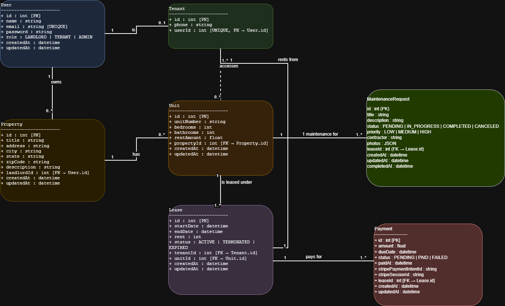

# Property Management System

A full-stack property management application for landlords and tenants, built with React, FastAPI, and PostgreSQL.

## 🎥 Presentation Video

**Watch our project presentation:** [https://youtu.be/lcoxETZLjfA](https://youtu.be/lcoxETZLjfA)

## 👥 Group Members

- **Mabishan Gopalakrishnan** - 100867283
- **Naveenan Vigitharan** - 100867059

## 🌐 External APIs Used

- **Google OAuth 2.0** - User authentication and authorization
- **Google Maps API** - Address autocomplete and property location services
- **Stripe API** - Payment processing and transaction management

## 🎉 Test Status

✅ **All 54 tests passing** 
- Authentication & Authorization: 14/14 ✅
- Dashboard & Statistics: 8/8 ✅
- Properties Management: 10/10 ✅
- Leases Management: 8/8 ✅
- Payments Management: 7/7 ✅
- Tenants Management: 7/7 ✅

## 🚀 Quick Start with Docker

### Prerequisites
- [Docker Desktop](https://www.docker.com/get-started) installed and running
- [Git](https://git-scm.com/downloads) installed

### Important: Environment Variables

⚠️ **The `.env` file with API keys is required but not included in the repository for security reasons.**

**For Instructors/Graders:**
- The complete `.env` file with all API keys (Stripe, Google OAuth) will be provided separately via submission or email
- Copy the provided `.env` file to `backend-python/.env` before running Docker commands
- A template `.env.example` is included in `backend-python/` for reference

### Step-by-Step Setup

1. **Clone the repository**
```bash
git clone https://github.com/MabishanGopalakrishnan/property-management-final.git
cd property-management-final
```

2. **Build and start all containers**
```bash
docker-compose up -d --build
```

This command will:
- Build the backend (FastAPI + Python) container
- Build the frontend (React + Vite) container  
- Start the PostgreSQL database container
- Create Docker networks and volumes automatically
- Takes approximately 1-2 minutes on first run

**Wait 5-10 seconds** for the database to initialize, then the application will be ready.

3. **Verify containers are running**
```bash
docker ps
```

You should see 3 containers running:
- `pm-backend-python` (Backend API)
- `pm-frontend` (React Frontend)
- `postgres_db` (Database)

4. **Access the application**
- **Frontend UI**: http://localhost:5173
- **Backend API**: http://localhost:5000
- **API Documentation**: http://localhost:5000/docs (Swagger UI)

### Managing the Application

**Stop all containers:**
```bash
docker-compose down
```

**Stop and remove all data (fresh start):**
```bash
docker-compose down -v
```

**Restart a specific service:**
```bash
docker-compose restart backend
docker-compose restart frontend
```

**View container logs:**
```bash
# View all logs
docker-compose logs -f

# View specific service logs
docker logs pm-backend-python
docker logs pm-frontend
docker logs postgres_db
```

## 🧪 Running Tests

Since the application runs in Docker, all tests must be run inside the backend container using `docker exec`.

### Run All Tests
```bash
docker exec pm-backend-python pytest -v
```

### Run Tests with Coverage Report
```bash
docker exec pm-backend-python pytest --cov=app --cov-report=term-missing
```

### Run Specific Test Files
```bash
# Run only authentication tests
docker exec pm-backend-python pytest tests/test_auth.py -v

# Run only property tests
docker exec pm-backend-python pytest tests/test_properties.py -v

# Run only payment tests
docker exec pm-backend-python pytest tests/test_payments.py -v
```

### Run Tests with Detailed Output
```bash
# Show print statements in tests
docker exec pm-backend-python pytest -v -s

# Show full error tracebacks
docker exec pm-backend-python pytest -v --tb=long
```

### Common Test Commands
```bash
# Run tests and stop on first failure
docker exec pm-backend-python pytest -x

# Run tests in parallel (faster)
docker exec pm-backend-python pytest -n auto

# Run only failed tests from last run
docker exec pm-backend-python pytest --lf
```

## 📁 Project Structure

```
property-management-final/
├── backend-python/          # FastAPI backend
│   ├── app/
│   │   ├── routers/        # API endpoints
│   │   ├── models.py       # Database models
│   │   ├── schemas.py      # Pydantic schemas
│   │   ├── auth.py         # Authentication
│   │   └── database.py     # Database connection
│   ├── tests/              # Test suite
│   ├── Dockerfile
│   └── requirements.txt
├── frontend/               # React frontend
│   ├── src/
│   │   ├── pages/         # Page components
│   │   ├── components/    # Reusable components
│   │   ├── api/           # API client functions
│   │   └── context/       # React context
│   ├── Dockerfile
│   └── package.json
└── docker-compose.yml     # Docker orchestration
```

## 🔑 First Time Setup

### Register a New Account

1. Navigate to http://localhost:5173
2. Click **"Register"**
3. Fill in the registration form:
   - Full Name
   - Email Address
   - Password (minimum 6 characters)
   - Role: Select **Landlord** or **Tenant**
4. Click **"Register"** to create your account

### Login

After registration, you'll be redirected to the login page:
1. Enter your email and password
2. Click **"Login"**
3. You'll be redirected to your dashboard

**Note:** The database is fresh on first run, so you'll need to register a new account before using the application.

## 💳 Testing Payments with Stripe

The application uses **Stripe** for payment processing in test mode. You can test the payment functionality using Stripe's test card numbers.

### Making a Test Payment

1. **Login as a Tenant** (or register a new tenant account)
2. Navigate to **Payments** section in the tenant portal
3. Click **"Pay with Stripe"** on any pending payment
4. You'll be redirected to Stripe's secure checkout page

### Test Card Information

Use the following test card details to simulate successful payments:

**Card Number:** `4242 4242 4242 4242`

**Expiration Date:** Any future date (e.g., `12/34`)

**CVC:** Any 3 digits (e.g., `123`)

**ZIP Code:** Any 5 digits (e.g., `12345`)

### What Happens After Payment

1. After entering the test card details, click **"Pay"**
2. Stripe will process the test payment
3. You'll be redirected back to the application
4. You'll see a success message: **"Payment completed successfully! 🎉"**
5. The payment status will automatically update to **"PAID"**
6. The payment will be visible in both:
   - **Tenant Portal** - Your payment history
   - **Landlord Portal** - Property payment records

### Additional Test Cards

Stripe provides other test cards for different scenarios:

- **Declined Payment:** `4000 0000 0000 0002`
- **Insufficient Funds:** `4000 0000 0000 9995`
- **Expired Card:** `4000 0000 0000 0069`

For more test cards, visit: [Stripe Testing Documentation](https://stripe.com/docs/testing)

## 🛠️ Technology Stack

### Backend
- **FastAPI** - Modern Python web framework
- **PostgreSQL** - Relational database
- **SQLAlchemy** - ORM
- **Pydantic** - Data validation
- **JWT** - Authentication
- **pytest** - Testing framework

### Frontend
- **React** - UI library
- **Vite** - Build tool
- **React Router** - Navigation
- **Axios** - HTTP client

### DevOps
- **Docker** - Containerization
- **Docker Compose** - Multi-container orchestration

## 📝 Features

### Landlord Features
- **Property Management** - Create, update, delete, and view properties with Canadian address format (Province, Postal Code)
- **Unit Management** - Manage multiple units per property with occupancy tracking
- **Tenant Management** - Add, view, and manage tenant profiles
- **Lease Management** - Create and track leases with automatic status updates
- **Payment Tracking** - Monitor rent payments and payment history
- **Maintenance Requests** - Receive and manage maintenance requests from tenants
- **Dashboard Analytics** - View statistics including total properties, occupancy rates, and revenue

### Tenant Features
- **Lease Information** - View current lease details and terms
- **Payment History** - Track rent payments and due dates
- **Maintenance Requests** - Submit and track maintenance issues with photo uploads
- **Profile Management** - Update personal information and contact details
- **Tenant Portal** - Dedicated interface for tenant-specific features

## 🔒 Security Features

- JWT-based authentication
- Role-based access control (Landlord/Tenant)
- Password hashing with bcrypt
- Protected API endpoints
- CORS configuration

## 📊 API Documentation

Once the backend is running, access the interactive API documentation at:
- **Swagger UI**: http://localhost:5000/docs
- **ReDoc**: http://localhost:5000/redoc

## 🏗️ Architecture


**External Integrations:**
- Google OAuth 2.0 (Authentication)
- Google Maps API (Address Autocomplete)
- Stripe API (Payment Processing)

### UML Class Diagram



The class diagram shows the complete object-oriented structure including:
- **7 Core Classes**: User, Tenant, Property, Unit, Lease, Payment, MaintenanceRequest
- **Relationships**: One-to-Many, Many-to-Many associations
- **Cardinality**: 0..1, 1, 0..*, 1..*
- **Attributes**: All fields with data types and constraints [PK], [FK], [UNIQUE]

## 🤝 Contributing

1. Fork the repository
2. Create a feature branch (`git checkout -b feature/amazing-feature`)
3. Commit your changes (`git commit -m 'Add amazing feature'`)
4. Push to the branch (`git push origin feature/amazing-feature`)
5. Open a Pull Request

## 📄 License

This project is licensed under the MIT License - see the [LICENSE](LICENSE) file for details.
